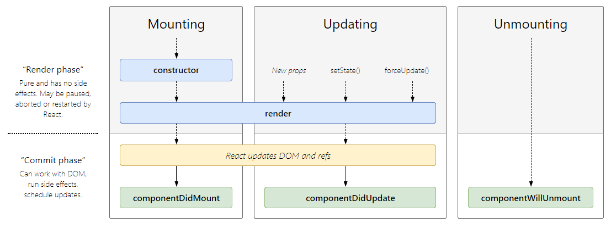

# React Component Lifecycle

## Learning Objectives
* Understand how to use React's lifecycle methods
* Retrieve data from an API inside of a component
* Handle events in React
* Look at the React documentation to learn more

## Framing (10 min / 0:10)

So far, we've used React components to build simple applications. We've added state and props and controlled data flow through them (using just the render and setState methods). In order to do more complex things, we'll have to use lifecycle methods.

How do we get data from an API? Well we could drop in an API call to fetch some data, but our component would likely render before the request finished. Our component would see that our data is `undefined` and either render a blank/empty component or throw an error.

How would we animate a component? (i.e. a sidebar that usually lives off the page, except for when a hamburger menu is pressed.) We could write some code to animate the position of the sidebar, but how could we guarantee it was running after our Sidebar component's render method had been called?

This lesson will walk us through the Component Lifecycle: hooks that are fired at different stages of a components "life" for solving the problems described above, as well as many others.

Throughout the course of this lesson, we'll build out a simple flashcard app with vocabulary keywords pulled from the Oxford Dictionary API. Our flashcard app will cycle through a set of flashcards, giving us 10 seconds to think of the definition before moving on to the next card.

But first, what is the Component Lifecycle?

## The Component Lifecycle (10 min / 0:20)

Components provide several lifecycle methods that you can use to control your application based on the state of the UI.

When you include these methods in the component they will be invoked automatically (because we are extending the React.Component class which has them already defined).

Lifecycle methods are called at specific points in the rendering process. You can use these methods to perform actions based on what's happening on the DOM.

**What do you use lifecycle methods for?**

Making asynchronous requests (API calls), binding event listeners to components, animating components (once they've rendered), and optimizing for performance (shouldComponentUpdate).

**Why is it called a lifecycle?**
It's an action that repeats in a specific order.



Click <a href="http://projects.wojtekmaj.pl/react-lifecycle-methods-diagram/">here</a> to view the above image as an interactive chart, complete with less common lifecycle methods.

### At a very high level

There are three types of component lifecycle methods:

* **Mounting** - occurs when the component is initially mounted, in this order:
  - <a href="https://reactjs.org/docs/react-component.html#constructor">`constructor`</a>
  - <a href="https://reactjs.org/docs/react-component.html#static-getderivedstatefromprops">`getDerivedStateFromProps`</a>
  - <a href="https://reactjs.org/docs/react-component.html#render">`render`</a>
  - <a href="https://reactjs.org/docs/react-component.html#componentdidmount">`componentDidMount`</a>

* **Updating** - occurs when a component is updated, in this order:
  - <a href="https://reactjs.org/docs/react-component.html#static-getderivedstatefromprops">`getDerivedStateFromProps`</a>
  - <a href="https://reactjs.org/docs/react-component.html#shouldcomponentupdate">`shouldComponentUpdate`</a>
  - <a href="https://reactjs.org/docs/react-component.html#render">`render`</a>
  - <a href="https://reactjs.org/docs/react-component.html#getsnapshotbeforeupdate">`getSnapshotBeforeUpdate`</a>
  - <a href="https://reactjs.org/docs/react-component.html#componentdidupdate">`componentDidUpdate`</a>
 
* **Unmounting** - occurs when the component is removed from DOM:
  - <a href="https://reactjs.org/docs/react-component.html#componentwillunmount">`componentWillUnmount`</a>
	
The documentation gives good examples of what each method should be used for. [Check out the documentation on components!](https://facebook.github.io/react/docs/react-component.html)

## Group Discussion (10 min / 0:30)

Break out into your groups for 5 minutes, and visit the <a href="https://reactjs.org/docs/react-component.html#the-component-lifecycle">React Commonly Used Lifecycle Methods</a> page together. Discuss the following questions:

* What is the **only** required method of a class-based component?
* How many times is `componentDidMount` called in a component's lifecycle?
* What lifecycle method is called any time a component updates?
* What is a potential issue that could occur when using `setState` inside of `componentDidUpdate`? How can we avoid this issue?

Be prepared to answer these questions in front of the class!

## We do: Exploring the Lifecycle methods (20 min / 0:40)

Let's clone down this repository with a short exercise for exploring the lifecycle methods.

This exercise is a simple, 2 "page" website where each page is a component. We'll be adding the component lifecycle methods to each page-component. As we do consider the following questions:

* What order are the methods run in? Before or after rendering?
* How many times is the method invoked?
* What causes the method to be (re)invoked?

> Add the mounting methods to HomePage.js and the update methods to AboutPage.js. console.log something in each method to understand the order.


### An Aside: Fetch (10 min / 0:50)

For our first example of working with the component lifecycle methods, we'll be retrieving data from an API. AJAX calls are asynchronous, so we have to be mindful of how long our request will take and when our components will render.

We're going to use a module named `fetch` to make our calls. Fetch is commonly used with React (and other frontend JS frameworks) to send HTTP requests to an API.

To use Fetch to query an API at a given url endpoint:

```js
fetch('url')
  .then((response) => {
    console.log(response)
  })
  .catch((error) => {
    console.log(error)
  })
```

### An Alternative: Axios

As an alternative to `fetch`, we could also use a module named `axios` to make our calls. Axios is a node module commonly used with React to send HTTP requests to an API. It functions much like jQuery's AJAX method, or `window.fetch()` but it includes extra features. Some benefits to using Axios:

* It is a promise-based library with an interface for simpler and cleaner syntax (compared to native XHR especially).
* It is lightweight and focused solely on handling HTTP requests (as opposed to jQuery which brings in an extensive set of new functions and methods)
* It is very configurable and has a number of useful methods for doing more complex requests from one or multiple API endpoints
* It handles a lot of the http header manual work for you (e.g. send a JSON file, it sets `Content-Type: application/json`)

Read more at the [Axios Documentation](https://github.com/mzabriskie/axios)

To load in the Axios module:

```js
// If you are using Babel to compile your code (you'll know you're using babel if your app started with create-react-app)
import axios from 'axios'

// In standard vanilla Javascript
let axios = require('axios')
```

To use Axios to query an API at a given url endpoint:

```js
axios.get('url')
  .then((response) => {
    console.log(response)
  })
  .catch((error) => {
    console.log(error)
  })
```

## Product Discovery App (90 min / 2:30)

As we dive deeper in to each of the component lifecycle methods and what they're used for, we'll work through the following exercise to create a simple app to discover cool products.

The starter code for this exercise can be found [here](https://git.generalassemb.ly/WC-SEI-322/React-Lifecycle-Product-Discovery).

Let's go ahead and clone the repository.

## React Documentation

* What is an uncontrolled component in React? Why would we use it instead of a controlled one?
* Describe 1-way and 2-way data binding. Which model does React use? Explain and compare to other popular front-end frameworks.
* Describe how to best gather information from a form in React. Be prepared to show code!
* Compare and contrast stateful, stateless, and functional components in React. List the pros and cons of each. When would we use one over the other?

## Event Handlers

Throughout the last few classes, you've seen a couple event handlers. These look similar to including them inline in HTML.

In the React Intro class, we went over how we are not actually interacting directly with the DOM when we write React code, rather, we are interacting with the virtualDOM. Because of this, when we call an event listener, we use `SyntheticEvent`'s instead of the usual event objects we are used to dealing with in JQuery events. We still get all of the same properties attached to them, and some additional ones. Because of this, the traditional documentation on event handlers is sometimes not accurate. Instead, use the React event handling documentation found [here](https://facebook.github.io/react/docs/events.html). Spend a few minutes looking at the different events on listed here.
